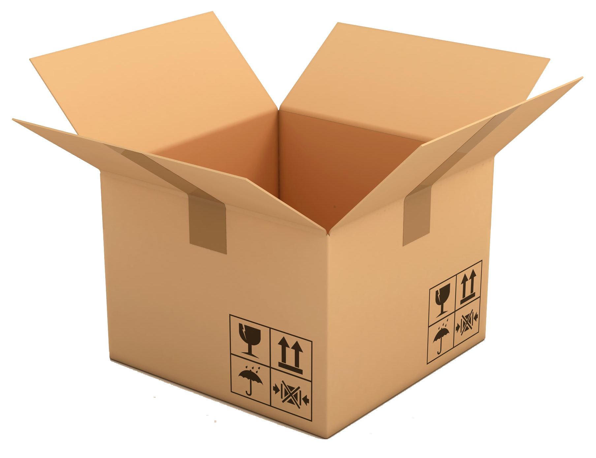
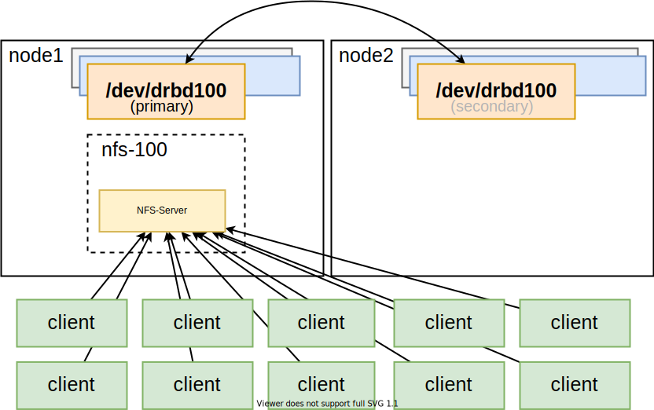
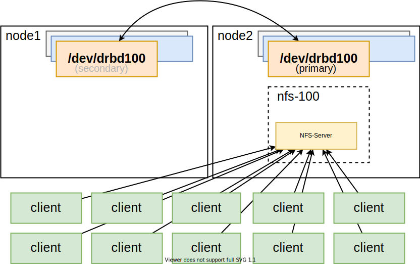
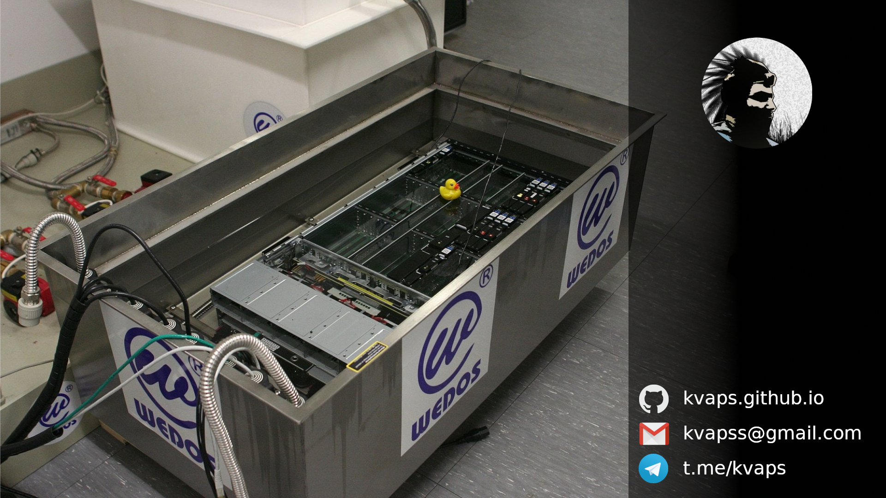

<!--
$size: 16:9
_class: front
-->

# В поисках идеальной кластерной ФС:  опыт использования LINSTOR

## Андрей Квапил

v0.0.1

---

# Что нам было нужно от хранилища

- OpenSource

- Производительность

- Надёжность

- Отказоустойчивость

- Простая интеграция

- Бесшовная миграция и обновление

- Снапшоты

---

# Типы хранилищ

* POSIX-совместимая файловая система

* Блочное хранилище

* Объектное хранилище

---

## Отказоустойчивый NFS-сервер

---

## Отказоустойчивый NFS-сервер

---

<!-- _backgroundColor: "#000" -->

---

# Бэкапы

- Resitc — отлично подходит для
  бэкапа блочных устройств

- Дедупликация работает из коробки

- Снапшоты для консистентности

- ZFS DRAID on the backend
   

<small>

> *Бэкап-хранилище для тысяч виртуальных машин свободными инструментами*
> https://habr.com/ru/post/504152/

</small>

---

<!-- _class: invert -->

# Вопросы?

---

